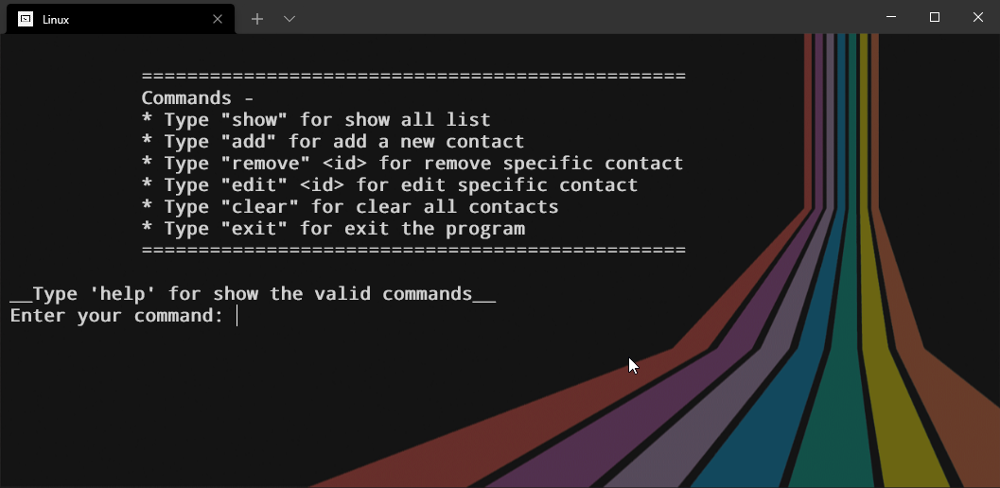

<h1 align="center">Contact list application - CLI</h1>

This is a full **CURD** application that build with python. It's can control with some specific commands. as like -
1. `help` - for see all valid commands.
2. `add` - for add a new contact in the contact list.
3. `show` - for show all saved contacts.
4. `edit <id>` - for edit a specific contact.
5. `remove <id>` - for remove a specific contact.
6. `clear` - for remove all contacts.
7. `exit` - for exit the whole program.

**help** - By this command it will represent you all valid commands like this -

**add** - if you would like to add a new contact to the contact list then this command for you

**show** - for show the contact list 💻

**edit** - for edit any specific contact run edit <contact id>

