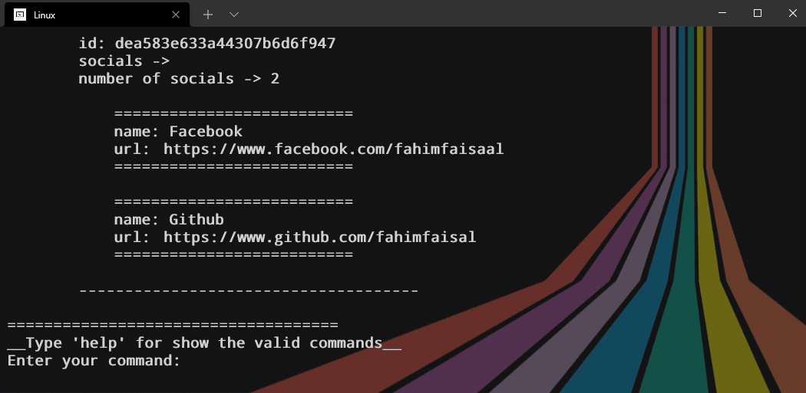

<h1 align="center">Contact list application - CLI</h1>

This is a full **CURD** application that builds with python. It's can control with some specific commands. as like -

1. `help` - to see all valid commands.
2. `add` - for adding a new contact in the contact list.
3. `show` - for show all saved contacts.
4. `edit <id>` - for edit a specific contact.
5. `remove <id>` - for remove a specific contact.
6. `clear` - to remove all contacts.
7. `cls` - for clear terminal
8. `exit` - for exit the whole program.

**All contacts are save on `./contacts/data.json`**

[here](https://app.diagrams.net/#Hfahimfaisaal%2Fcontact_list_app%2Fmaster%2FUML_Diagram%2FContact_list.drawio) is the UML diagram.

### help - By this command it will represent you all valid commands like this

### add - if you would like to add a new contact to the contact list then this command for you

---
### show - for show the contact list 💻

---
### edit <id> - for edit any specific contact run edit <contact id>

---
### remove <id> - for remove any specific contact run remove <contact id>

---
### clear - remove all contacts

---
### exit - close the program

